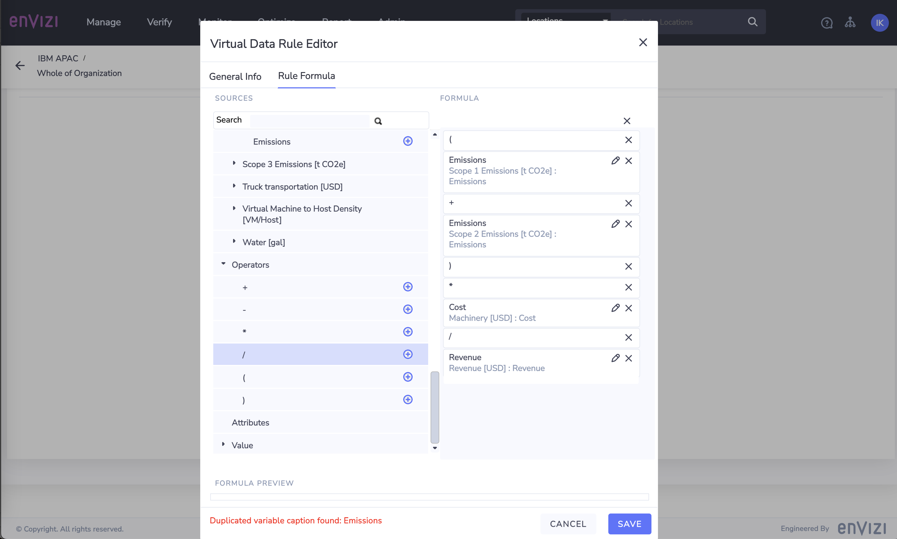

# Unlocking Envizi Virtual Accounts for Scope 3 Hybrid Calculation methodolgy

## Scope 3 Emissions calculation methods
### Spend-based
### Hybrid
### Average
### Supplier-specific

# Scope 3 Hybrid method of calculation

## Scope 3 introdcution

Scope 3 emissoions are all indirect emissions which are the result of the activities from assets not owned or controlled by the reporting organization.  Scope 3 emissions are basically all other indirect emissions that occur in a company’s value chain. For majority of the companies, Scope 3 emissionss have the most significant contribution in their overall GHG emissions.

## Scope 3 Categories and Calculation Methods supported in Envizi

The GHG Protocol defines 15 categories of scope 3 emissions which include emissions for  both upstream and downstream of the organization’s activities.

There are 4 different calculation methods available for calculating Scope 3 emissios and depedends the availability of data for the reporting company. 

### Spend-based method
Estimates emissions for goods and services by collecting data on the economic value of goods and services purchased and multiplying it by relevant secondary (e.g., industry average) emission factors (e.g., average emissions per monetary value of goods).

### Hybrid method
Uses a combination of supplier-specific activity data (where available) and secondary data to fill the gaps. 

### Average-data method 
Estimates emissions for goods and services by collecting data on the mass (e.g., kilograms or pounds), or other relevant units of goods or services purchased and multiplying by the relevant secondary (e.g., industry average) emission factors (e.g., average emissions per unit of good or service).

### Supplier-specific method
Collects product-level cradle-to-gate GHG inventory data from goods or services suppliers.

Envizi supports all these 4 methods with respect to Scope 3 Cat 1 and Cat 2. For methods like Spend-based and average, Envizi can directly calculates the emissions by applying the respective emission fator eg, Emission factor per USD,etc for spend-based and Emission Facor for Product mass/volume, etc for average based calculations.  When it comes to Supplier-specific method, Envizi can capture the emissions for given product (PCF data) directly from the Suplier. 

When it comes to Hybrid method, there is a need to explicitly configure the emission calculation based on the data available. Lets look at one such example with industry specific usecase and how we can leverage Envizi Virtual accounts functionality for the same in the below section.

## Usecase: Scope 3 emission calcuation using Hybrid method

In this usecase we will use  Bank as an example industry usecase. Lets say Bank purchases some  goods and  inventory like machinary / equipment which comes under the Scope 3 category 1 & 2. Now, Bank is responsible to accurately calculate the scope 3 emissions. Based on the availability of data, Bank adapts various methodologies and targets to move towards the more accurate method which is supplier-specific. 
In this journey, initially Bank may starts with Spend-based methodology and  then slowly getting into capturing more relavant data of the supplier, which they can get directly from supplier or rely on third party sources. 

For example, the following data is now available with the Bank

- Scope 1 and 2 emissions of the Supplier. This data is either available directly from Supplier or can be extracted from the ESG reports published by Supplier or available with 3rd party providers like CDP. 
- Total revenue of Supplier
- Total amount spent on Supplier

Based on this data, Bank can apply the Hybrid method and calculate the emissions using the below formula.
- ***(Supplier Scope 1 + Scope 2 Emissions) x  Total amount spent on Supplier /  Total revenue of Supplier.***

Lets look how Envizi helps for this usecase. 

1. Capture the required data:
   - First, all the input data captured from either from suppliers or third party sources can be recorded into  Envizi's accounts. Below screenshot shows the different Envizi accounts holding the data. 
  

2. Configure the Scope3 emissiosn using Hybrid method calculation  
   - Once the required data is available in the platform, we have to configure the calculation logic into Envizi.  This is where Virtual Accounts of Envizi play a role. 

    #### Envizi Virtual Accounts
    Virtual Accounts are accounts where data is automatically derived from the monthly data of other accounts, meters, and even static attribute values. 
    Virtual accounts are automatically populated with the data based on the Virtual Data Rules which is critical part of the solution. 
    In this usecase, we will define the Hybrid method calculation as Virtual Data rule. The fields of the Virtual data rule will be mapped to appropriate input source and the output of the formula or the rule will be recorded into the Virtual account. 

    So, the steps to follow are. 

        1. Create the destination account for Scope3 Emissions 
        2. Create Virtual Data Rule
        3. Define the Formula
        4. Setup  account as Virtual Account
        5. Review Account Summary / Monthly Data in Virtual Account 
        
**2.1 Create Scope 3 Emissions account representing Supplier Emissions.**

Assuming that we already have captured the Scope 1 and Scope 2 Emissions of the Supplier in to the platform. To hold the Scope 3 emissions based on the Supplier Scope1 and Scope2, let us create an account as below.

- Navigate to **Manage** and click on **Accounts**
- Click on **Create New Account** on **Accounts** page
- Select Location : Chose appropriate location to capture the Scope 3 emission data- **IN Bank - CG - Supplier1**
- Select Account Style : **S3.2 - Scope 3 Emissions - t CO2e**
- Select Account Number : **IN Bank - CG -Scope3 -VA- Emissions**
- Click **Save**

**2.2 Create Virtual Data Rule**

   In the following section we will configure the following formula as below. 

      Output: Scope 3 emission for supplier =   (A + B) * D / C 

         A - Scope 1 Emissions of Supplier
         B - Scope 2 Emissions of Supplier
         C - Total revenue of Supplier
         D - Spend on supplier by Reporting company
   

   1. In Envizi Homepage , navigate to  Admin -> Virtual Accounts -> Virtual Data Rules

   2.  Based on the formula, align the values for each of the fields in the **General Info** tab
   Here we are calculating Scope 3 emissions for the reporting company, hence the destination scope and data types should be scope 3 related

       1.  Provide *Name* : Name of the rule or formula
       ex: IN Bank- CG - Supplier1 - Scope3 Emissions - Calculated
       2. Destination Scope: **Scope 3**
       3. Destination Type: **Scope 3 Emissions[t CO2e]**
       4. Destination Measure: **Emissions**
    

   
   3. Navigate to **Rule Forumla** tab 
   Now, create the formula by chosing appropriate data types and measures to define the formula parameters
   
   - **Parameter A: Scope 1 Emissions of Supplier.**
     - Expand  **Measures** and scroll down to select **Scope 1 Emissions [t CO2e]**
     

     - Expand the **Scope 1 Emissions [t CO2e]** and select **Emissions**
     - Click on **+** to chose the **Emissions** as our first measure in the formula

               

   - **Select Operator Addition(+)**
     -  Scroll down on the Rule Formula page and expand **Operators** 
     -  Select **+** and click on +

  

   - **Parameter B: Scope 2 Emissions of Supplier**
     -  Expand  **Measures** and scroll down to select **Scope 2 Emissions [t CO2e]**
     -  Expand the **Scope 2 Emissions [t CO2e]** and select **Emissions**
     -  Click on **+** to chose the **Emissions** as our first measure in the formula

     

   - **Select Operator (**
     -  Scroll down on the Rule Formula page and expand **Operators** 
     -  Select **(**  and click + 
     -  Move **(** to top of the Formula

   - **Select Operator )**
     -  Scroll down on the Rule Formula page and expand **Operators** 
     -  Select **)**  and click +          

The formula looks like this
     

   - **Select Operator Multiplication(x)**
     -  Scroll down on the Rule Formula page and expand **Operators** 
     -  Select **x**  and click +          

   - **Parameter D: Spend on supplier by Reporting company
     -  Expand  **Measures** and scroll down to select **Machinery [USD] **
     -  Expand the **Machinery [USD]** and select **Cost**
     -  Click on **+** to chose the **Cost** 

   - **Select Operator Divsion(/)**
     -  Scroll down on the Rule Formula page and expand **Operators** 
     -  Select **/**  and click +          

   - **Parameter C: Total revenue of Supplier
     -  Expand  **Measures** and scroll down to select **Revenue [USD] **
     -  Expand the **Revenue [USD]** and select **Revenue**
     -  Click on **+** to chose the **Revenue** 

That completes the formula and it should like as below

     

And if there are any errors related to parameters names as shown in the above screen, "Duplicated variable caption found: Emissions", rename the captions of these parameters to appropriate naming convensions in meanigful way.
   - Rename the parameter names :
     -  Select pencil icon on **Emissions** 
     -  On the popup window, update **Caption** to **Supplier1 Scope1 Emissions**
     -  Click Confirm

     
   
   - Similarly rename other parameters as you think more meanigful  
   - The formula looks as below once configure and **Save**  

This completes the creation of the formula creation. In the next section, lets look at how to leverage this formula to execute and calculate the Scope 3 emissions

**2.3 Setup the Scope 3 account as  Virtual account**

In Section 2.1, we have already created an account to hold  Scope3 Emissions. Now follow the steps below to setup the same account as Virtual account.
- Navigate to Manage -> Accounts -> Select the Scope 3 account created in 2.1  : **IN Bank - CG -Scope3 -VA- Emissions**
- Click on **Actions**
- Click on **Virtual Account Setup**

- On **Virtual Account Relationships** Click on **Create New ** to create the new Virtual Relationship

- On **Virtual Relationship** , navigate to  **Select Rule** tab 
- Select **Emissions** from **Measures** drop-down
- In  **Data Rule** drop-down, select the rule created in secton 2.2.2 **IN Bank- CG - Supplier1 - Scope3 Emissions - Calculated**

- Navigate to tab  **Source Data**
- View the measures/ parameters  of the selected data rule and select appropriate source account to provide the input to the formula parameters

- Expand the first parameter **Supplier1 S1 Emissions**
- Expand **IN Bank - CG - Supplier1 **
- Select the account **IN Bank - CG - Supplier1 Scope 1 Emissions**
- Click on + to select the account

- Similarly chose the source for all other parameters from the available source accounts under each measure. 
- Below is the screenshot after selecting the sources
  

- Navigate to tab  **Condtion (optional)**
- Select **Effective from and Effective to** dates
  

- Click **Save**

The virtual account is successfully set up and you can view the **Virtual Account Relationships**
  

- Navigate back to account **IN Bank - CG - Supplier1 Scope 1 Emissions**
- Click on **Actions** 
- Observe that **Records** and **Capture Data** menu items are disabled. This is expected behavior because the data is automatically recorded into the account based on calculation of the virtual data rule setup.  
 

- Click on **Monthly Data**
- Observe that the data is already logged into the account which is the Scope 3 Emissions data
 

This completes calculation of Scope3  emissions based  on the Hybrid methodology leveraging the Envizi Virtual Accounts feature.

## Conclusion

The article provides step by steps instructions on how to use Envizi for custom calculations /formulas to meet the needs of various business requirements with an example of Scope 3 emission calculation using Hybrid Methodology.  The article explained the detail steps of creating the virtual data rules to implement the custom formula and associating the virtual rule / formula to an account abd mapping the inputs / source account to fetch the data to be used for calculation. 
Similarl  to Hybrid calculation of Scope 3 emission, the virtual accounts can be leverage for various scennarios where there is requirement to implement simple calcuations with in the platform.

